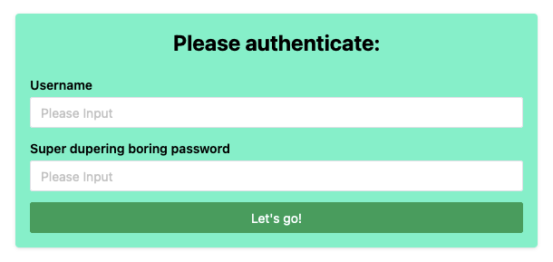

# Tech Talk-a thon (25.04.2024)



Welcome to the second Sidestream Tech Talk-a thon! Below you can find the prompt to begin your little challenge. Good luck and have fun!

## The prompt

The prompt for this challenge is:

> Passwords are from the past! Find a new way to allow users to authenticate themselves.

You can interperate this prompt as freely as you want! Anything is allowed as long as you complete it within the 30 minutes!

## Instructions

In your teams of two, you will have 30 minutes to complete a small application concerning itself with a certain prompt. You will be provided with a Stackblitz instance that you can use for coding, however you are also welcome to clone the starter or create your own locally, based on your preference. However, keep in mind that this may cost you some time.

The goal of this challenge is to have fun and work together with people you may not normally work with during your normal workdays. Therefore, don’t stress, take it relaxed and have some fun (side conversations are always welcome!). You do not need to fully complete the challenge, it would however be nice to show something to the others!

## Quick Start

This is a [sidebase merino](https://sidebase.io/) app created by running `pnpm create sidebase@latest`. This project uses the following technologies for a great developer- and user-experience:
- [TypeScript](https://www.typescriptlang.org/)
- [Nuxt 3](https://nuxt.com)
- Tailwind CSS
- Naive UI
- Linting via ESLint and @antfu/eslint-config

## How to get going?

This is a straight-forward setup with minimal templating and scaffolding. The options you selected during the sidebase CLI setup are all here though. Good places to continue reading are:
- [the First Steps documentation](https://sidebase.io/sidebase/usage)
- [our discord](https://discord.gg/auc8eCeGzx)

Some tasks you should probably do in the beginning are:
- [ ] replace this generic README with a more specific one
- [ ] install the Vue Volar extension
- [ ] enable [Volar takeover mode](https://nuxt.com/docs/getting-started/installation#prerequisites) to ensure a smooth editor setup
- [ ] [install Nuxt 3 devtools](https://github.com/nuxt/devtools#installation) if you want to use them
- [ ] Auth: Configure your auth providers to the [NuxtAuthHandler](./server/api/auth/[...].ts)
- [ ] Auth, optional: Enable global protection by setting `enableGlobalAppMiddleware: true` in [your nuxt.config.ts](./nuxt.config.ts). Delete the local middleware in the [protected.vue](./pages/protected.vue) page if you do

### Setup

Make sure to install the dependencies:

```bash
pnpm install
```

### Development Server

Start the development server on http://localhost:3000

```bash
pnpm run dev
```

### Production

Build the application for production:

```bash
pnpm run build
```

Locally preview production build:

```bash
pnpm run preview
```
